# Fraud Monitor: Enterprise Fraud Detection System

This project is a full-stack application designed to simulate a real-time fraud detection system. It combines a Python backend powered by Flask and an **XGBoost machine learning model** with a React frontend to provide a seamless user experience for both customers and administrators.

The system can identify and block potentially fraudulent transactions in real-time, providing a dashboard for administrators to monitor and manage transaction activities.

## How the Application Works

### Login and Role Selection

The application starts with a login screen that serves as the entry point for both customers and administrators.

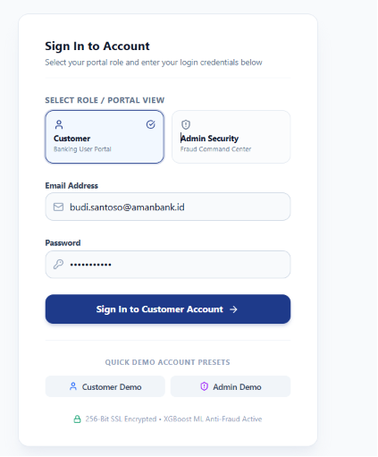

#### Key Features & Main Functions

- **Role Selection (RBAC):** Allows users to choose between two different portal views:
  - **Customer Portal:** For regular banking users to make transfers and view their transaction history.
  - **Admin Security Portal:** For security staff to monitor the Fraud Command Center and check suspicious transactions.
- **Quick Demo Accounts:** Provides one-click login options (`Customer Demo` and `Admin Demo`) so users can quickly access the system without entering login details manually.

## Key Features

- **Dual User Portals**: Separate interfaces for regular customers and administrators.
- **Real-time Transaction Monitoring**: Live feed of incoming transactions.
- **ML-Powered Fraud Detection**: A machine learning model evaluates each transaction to assess its risk.
- **Admin Command Center**: Allows administrators to view system performance, blocked transactions, and model analytics.
- **Secure Authentication**: JWT-based authentication to protect user accounts and data.

## Technology Stack

### Backend

- **Python**: The core programming language for the backend server and machine learning model.
- **Flask**: A lightweight web framework used to build the REST API that serves the model and handles transactions.
- **Pandas**: Used for efficient data manipulation and analysis, especially during the model training phase.
- **NumPy**: Essential for numerical computations and handling large multi-dimensional arrays.
- **Matplotlib** and **Seaborn**: Used to create charts and visualize the data.
- **XGBoost (XGBClassifier)**: A machine learning algorithm used to build the classification model for fraud detection.
- **Scikit-learn (sklearn)**: Provides essential tools for model evaluation, such as calculating accuracy, precision, recall, and confusion matrices.

### Frontend

- **React**: A JavaScript library used to build interactive and responsive web pages
- **TypeScript**: A version of JavaScript that adds types to help make the code easier to manage and reduce errors.
- **Axios**: A tool used to send requests between the frontend and backend API.
- **Tailwind CSS**: used to design and style the website.

### Real-Time Fraud Detection Metrics

The following image shows the real-time fraud detection metrics from the administrator's dashboard:

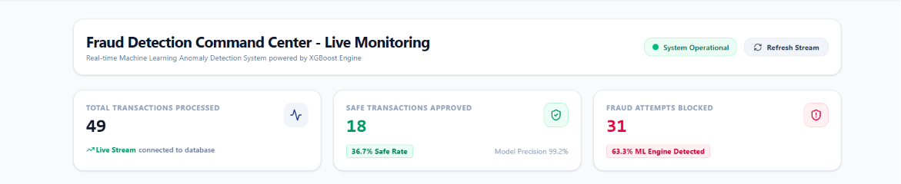

- **Total Processed Transactions**: Shows the number of transactions processed in real time. In this case, 49 transactions were recorded.
- **Automatic Fraud Detection**: From the 49 transactions, 31 fraudulent transactions (63.3%) were detected and blocked by the XGBoost model, while 18 normal transactions (36.7%) were approved.

### Transaction History Table

The screenshot below displays the real-time transaction feed interface where incoming transactions are continuously evaluated by the XGBoost Machine Learning engine:

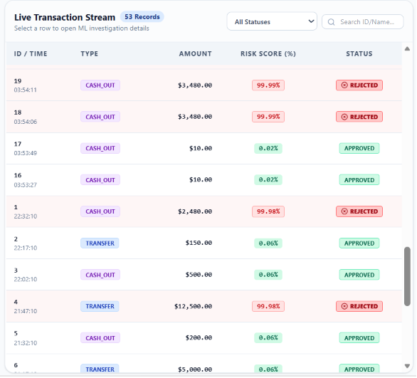

### ML Investigation Panel (Approved Scenario)

- **AI Explanation:** Shows how the model made its decision for Transaction #3 (`CASH_OUT $500.00`).

- **Risk Score:** Shows a low risk score of **0.06%**, which is below the **50.00% block limit**. This means the transaction was approved.

- **Safety Check:** The system checks important details, such as `Balance Emptied = NO` and a normal **+45m** transaction interval, before automatically approving the transaction.

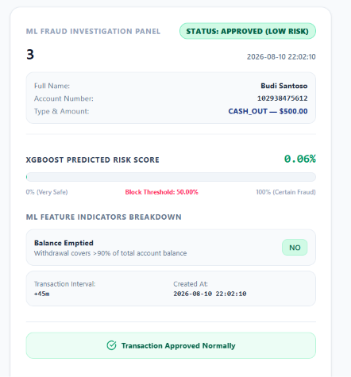

### ML Investigation Panel (Blocked Scenario)

- **Fraud Detection**: Shows why Transaction #18 (`CASH_OUT $3,480.00`) was marked as suspicious by the model.
- **High Risk Score**: The transaction received a **99.99%** risk score, which is above the **50.00%** block limit. Because of this, the transaction was blocked.
- **Main Warning Sign**: The transaction happened very quickly after the previous one (**Transaction Interval: +0m**). This can be a sign of automated or suspicious activity, so the system blocked the transaction immediately.

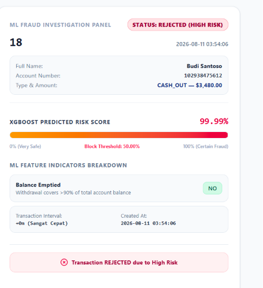

### Customer Portal: Transaction Simulation

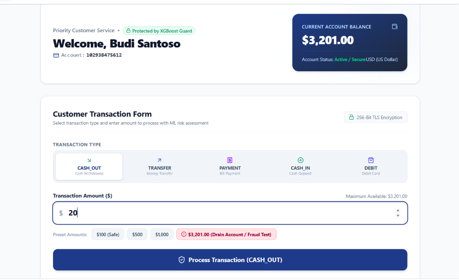

#### Step-by-Step Inference Flow

1.  **User Input & Transaction:**
    - The user chooses a transaction type, such as `CASH_OUT`, `TRANSFER`, or `PAYMENT`, and enters the transaction amount, such as `$20.00`.
    - The form also provides **Preset Amounts**, including a test option (`$3,201.00 - Drain Account / Fraud Test`) to simulate a fraud transaction.

2.  **Feature Calculation (Backend):**
    - After the user clicks **`Process Transaction`**, the transaction data is sent to the backend through a secure 256-bit TLS connection.
    - The backend calculates several features before sending the data to the model:
      - **`errorBalanceOrig`**: Checks the difference between the account balance and the transaction amount.
      - **`isBalanceEmptied`**: Checks whether the transaction uses the entire account balance (`$3,201.00`).
      - **`step / delta`**: Checks the time between the current and previous transaction.

3.  **XGBoost Prediction & Decision:**
    - The XGBoost model checks the transaction and gives a risk score within milliseconds.
    - **If Risk Score < 50%:** The transaction is `APPROVED`, the account balance is updated, and the transaction is recorded as low risk.
      -\* **If Risk Score ≥ 50%:** The transaction is `REJECTED`, the money is not sent, and an alert is shown on the **Admin Dashboard**.

#### Transaction Outcome: Approved

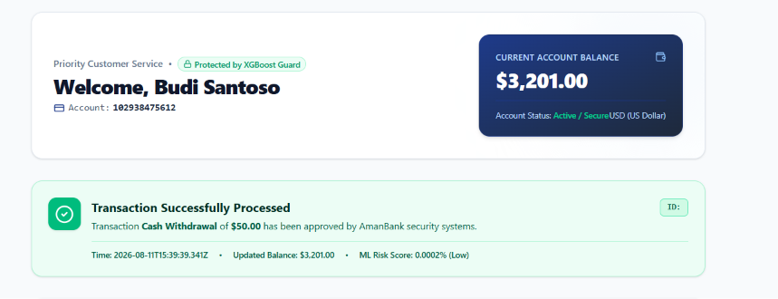

- **Instant Approval Message**: Tells the user when a transaction, such as a $50.00 cash withdrawal, is approved by the security system.
- **Risk Score**: Shows the transaction's risk score in real time (0.0002%) along with the UTC time of the transaction.
- - **Automatic Balance Update**: The customer's account balance and security status are updated immediately on the dashboard.

#### Transaction Outcome: Blocked

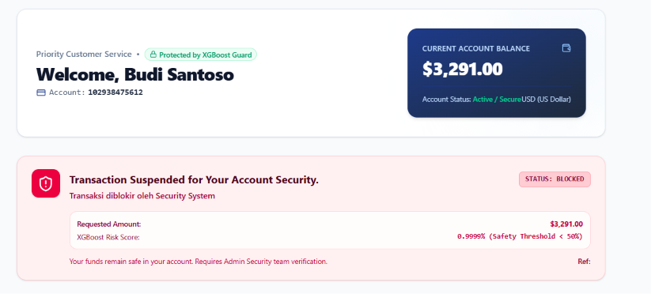

- **Automatic Blocking**: The system immediately stops high-risk transactions, such as an account drain attempt of $3,291.00, before the transaction is completed.
- **Risk Score**: Shows the transaction's risk score (99.99%) compared with the system's 50.00% safety limit. Since the score is higher than the limit, the transaction is blocked.
- - **Balance Protection**: Shows a clear message to the customer that their money is still safe. The suspicious transaction is also reported to the Admin Security team for further review.

#### Customer Transaction Log

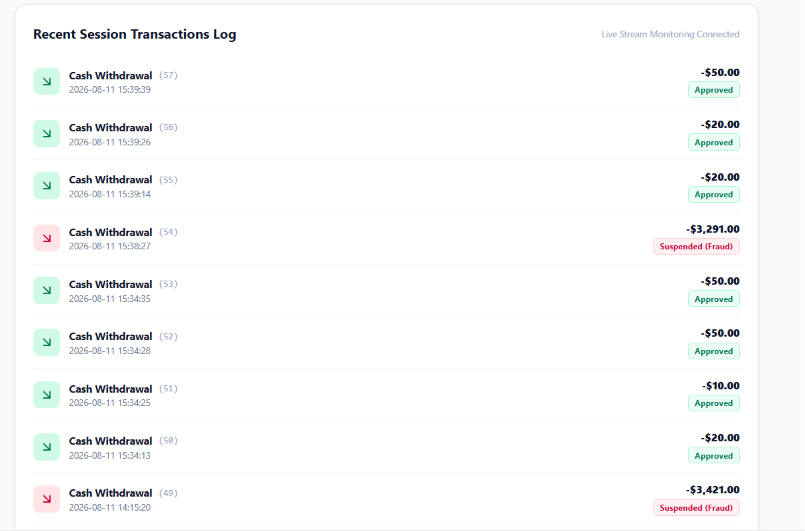

- **Live Data Sync**: The system connects to the database and updates the user's activity log in real time.
- **Clear Transaction Status**: Shows transaction history in order and clearly labels each transaction as `Approved` or `Suspended (Fraud)`.
- **Fraud Highlighting**: Uses different colors to make fraud attempts easy to see, such as `-$3,291.00 Suspended`, while normal transactions like `-$50.00 Approved` are shown as safe.

## Model Development Process

The core of our fraud detection capability lies in a machine learning model trained to distinguish between legitimate and fraudulent transactions. Below is an overview of the development and evaluation process.

### 1. Dataset Analysis

We started with a large set of transaction data from a public Kaggle dataset. First, we looked at the number of fraudulent and normal transactions to see if there was an imbalance between the two groups and to understand the main features of the data.

**Dataset Source**: [Fraud Detection Dataset on Kaggle](https://www.kaggle.com/datasets/amanalisiddiqui/fraud-detection-dataset)

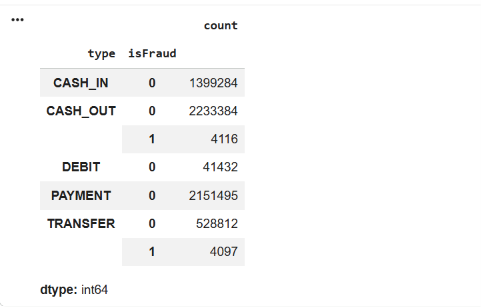

The analysis above shows a summary of the transaction data. We can see that fraudulent activities (where `isFraud` is 1) only occur in `CASH_OUT` and `TRANSFER` transaction types. Other types like `CASH_IN`, `DEBIT`, and `PAYMENT` show no instances of fraud in this dataset. This is a critical insight, as it allows our model to focus on the patterns within the two riskiest transaction types. The data also shows a significant imbalance, with far more legitimate transactions than fraudulent ones, which is a common challenge in fraud detection that our model is designed to handle.

### 2. Model Training & Validation

**Early Stopping & Iterations:**

- The model was trained using the `AUCPR` (_Area Under the Precision-Recall Curve_) score to check its performance on the validation data.
- At the beginning of training, the model had a high validation AUCPR score of **0.99844** at iteration `[0]`. The score increased to around **0.99989** at iteration `[100]`.
- Early stopping stopped the training at around iteration `[163]` to help prevent overfitting and improve the model's performance on new data.

**ROC-AUC Score (`0.9998`)**: This shows that the model is very good at telling the difference between normal and fraudulent transactions at different decision levels.

**PR-AUC Score (`0.9984`)**: This score is important because the dataset has many more normal transactions than fraudulent ones. A PR-AUC score of **99.84%** shows that the model can correctly find fraudulent transactions while keeping the number of incorrect predictions low.

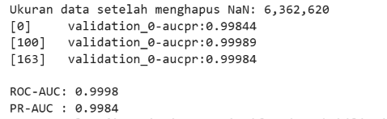

### 3. Performance Evaluation

### Key Insights & Analysis

1. **No Overfitting (Good Generalization):**
   - The difference between the **Train and Test** results for all evaluation metrics is very small, around **-0.001 to -0.008**.
   - Overfitting usually happens when a model performs much better on training data than on testing data. In this case, the testing results are almost the same as, or slightly better than, the training results. This shows that the model works well on new data.
   - the regularization techniques (`max_depth=4`, `gamma=0.1`, `reg_alpha=0.1`, and `early_stopping_rounds=50`) helped reduce the risk of overfitting.

2. **High Precision and Recall for Fraud:**
   - **F1-Score (Fraud) = 0.9855 (98.55%)**: The model is very good at finding fraudulent transactions while keeping incorrect fraud warnings low.
   - **PR-AUC = 0.9967**: This shows that the model can detect fraudulent transactions well, even though there are far fewer fraud cases than normal transactions.

3. **High Overall Accuracy (99.99%):**
   - The high accuracy shows that the model can correctly identify most normal transactions and avoid wrongly blocking legitimate customers.

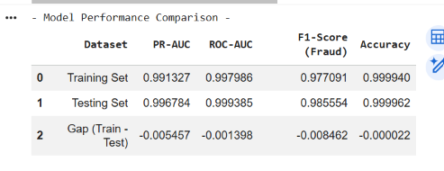

### 4. Confusion Matrix

- **True Negatives (TN = 953,034):** The model correctly identified **953,034 normal transactions** as non-fraudulent, allowing most normal transactions to go through without problems.

- **True Positives (TP = 1,230):** The model correctly detected **1,230 fraudulent transactions**, helping prevent possible financial losses.

- **False Negatives (FN = 2):** Only **2 fraudulent transactions** were missed by the model. This means the missed fraud rate was less than **0.16%**, showing that the model was very good at detecting fraud.

- **False Positives (FP = 127):** Only **127 normal transactions** were incorrectly marked as fraud out of nearly 1 million transactions. This shows that the model produced very few false alarms and had high **Precision**.

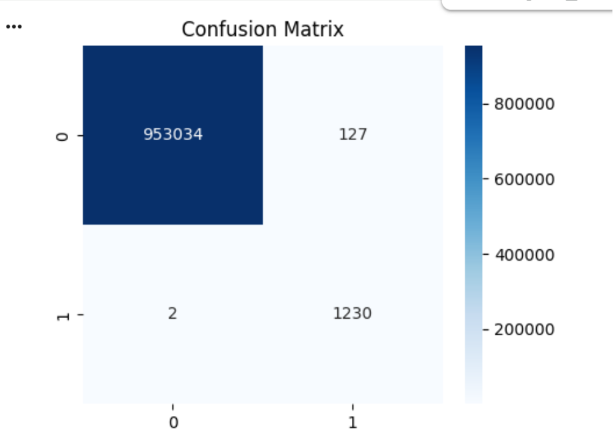

### 5. Feature Importance

### Key Feature Insights & Domain Explanation

1. **`isBalanceEmptied` (~47% Importance):**
   - **Most Important Feature:** This feature shows whether a transaction completely emptied the sender's account balance (`oldbalanceOrg > 0` and `newbalanceOrig == 0`).
   - **Why It Matters:** Fraudsters may try to take all the money from an account in one transaction before the account owner or bank notices the activity.

2. **`errorBalanceOrig` (~36% Importance):**
   - **Custom Feature:** This feature is calculated as `newbalanceOrig + amount - oldbalanceOrg`.
   - **Why It Matters:** It checks whether there is a difference between the account balance before and after a transaction. In a normal transaction, the result should be close to zero. A different result may indicate unusual or suspicious activity.

3. **`amount` & Account Balance Features (~15% Combined Importance):**
   - **`amount`:** The transaction amount is important because fraudulent transactions may involve unusually large amounts compared to normal transactions.
   - **`oldbalanceOrg` / `oldbalanceDest` / `newbalanceDest`:** These features provide information about the account balances before and after the transaction.

4. **Categorical & Time Features (`type_PAYMENT`, `step`):**
   - Features such as `step` and `type_PAYMENT` provide additional information about the transaction. However, the balance-related features are more important for identifying fraudulent transactions.

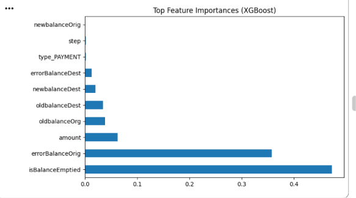

## Project Setup

To run this project locally, follow these steps:

### Prerequisites

- Python 3.8+
- Node.js and npm

### 1. Clone the Repository

```bash
git clone <repository-url>
cd fraud-detection
```

### 2. Backend Setup (Flask)

Navigate to the `backend` directory and install the required Python packages.

```bash
cd backend
pip install -r requirements.txt
```

To start the Flask server, run:

```bash
python app.py
```

The backend will be running at `http://127.0.0.1:5000`.

### 3. Frontend Setup (React)

In a new terminal, navigate to the `frontend` directory and install the Node.js dependencies.

```bash
cd frontend
npm install
```

To start the React development server, run:

```bash
npm start
```

The frontend will be accessible at `http://localhost:3000`. You can now open this URL in your browser to use the application.
